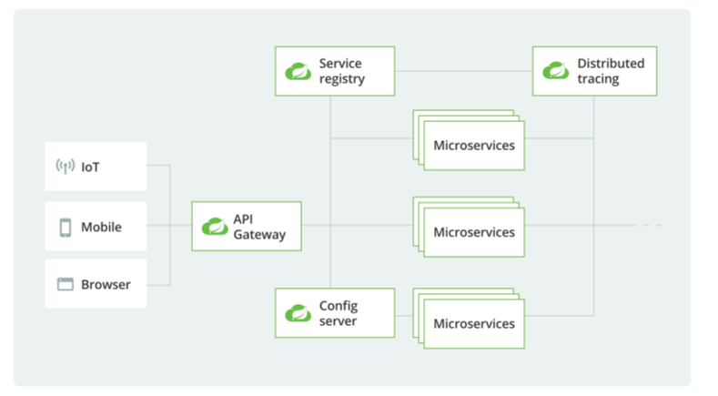

# spring cloud 란?

- 스프링 클라우드는 스프링 프레임워크 기반의 클라우드 네이티브 애플리케이션을 개발하기 위한 프로젝트이다.
- 스프링 클라우드는 개발자가 분산 시스템에서 일반적인 패턴(구성 관리, 서비스 검색, 라우팅, 마이크로 프록시 등..) 을 빠르게 빌드할 수 있는 도구를 제공한다.
- 분산 시스템의 조정은 보일러 플레이트 패턴으로 이어지고 스프링 클라우드를 사용하는 개발자는 이러한 패턴을 구현하는 서비스와 애플리케이션을 빠르게 구축할 수 있다.

<스프링 클라우드 아키텍처>

---

스프링 클라우드는 다음과 같은 기능을 제공한다.

``Service discovery`` : 서비스 디스커버리는 마이크로서비스 환경에서 서비스를 검색하고 호출하기 위한 기능이다.\
스프링 클라우드는 Netflix OSS의 Eureka, Apache ZooKeeper, Consul 등 다양한 서비스 디스커버리 툴과 통합되어있다.

``API Gateway`` : API 게이트웨이는 여러 개의 마이크로서비스에서 제공하는 API를 단일 진입점으로 노출해주는 역할을 한다.\
스프링 클라우드는 Netflix OSS의 Zuul, Spring Cloud Gateway 등 다양한 API 게이트웨이를 제공한다.

``분산 설정(Distributed Configuration)`` : 분산 설정은 마이크로서비스에서 필요한 설정 정보를 중앙에서 관리하고, 변경사항을 런타임 중에 적용할 수 있는 기능이다.\
스프링 클라우드는 분산 환경에서의 설정 관리를 위한 Spring Cloud Config를 제공한다.

``분산 추적(Distributed Tracing)`` : 분산 추적은 분산 시스템에서의 트랜잭션을 추적하기 위한 기능이다.\
스프링 클라우드는 분산 추적을 위한 Spring Cloud Sleuth와 Zipkin을 제공한다.

``로드밸런싱`` : 로드밸런싱은 여러 개의 인스턴스에서 제공되는 서비스를 균등하게 분산시켜주는 기능이다.\
스프링 클라우드는 Ribbon을 사용한 로드 밸런싱을 제공한다.

``회로 차단기 (Circuit Breaker)`` : 서킷브레이커는 마이크로서비스에서 일시적으로 문제가 발생하여 서비스가 다운될 때, 다운된 서비스에 대한 요청을 차단하고\
다른 대체 서비스를 호출하는 기능이다. 스프링 클라우드는 Netflix OSS의 Hystrix를 사용한 서킷브레이커를 제공한다.

마이크로서비스 아키텍처에서 필수적 Spring Cloud는 분산 시스템을 구축하고 운영하기 위한 프레임워크와 라이브러리를 제공하는 오픈 소스 프로젝트이다.

- Spring Cloud는 Netflix OSS 프로젝트에서 시작한 것으로 Eureka, Ribbon, Hystrix, Zuul 등 다양한 서비스를 포함하고 있다.
- Spring Cloud는 Spring Boot와 밀접하게 연관되어 있어, SpringBoot를 기반으로 하는 애플리케이션에서 Spring Cloud 기능을 쉽게 활용할 수 있다.

---

## 역할

### Spring Cloud Config

중앙 집중식으로 애플리케이션의 설정 정보를 관리할 수 있도록 하는 프레임워크이다.\
이를 통해 애플리케이션의 설정 정보를 쉽게 수정하고 배포할 수 있다.\
Config 서버는 Git, Subversion, Vault 등 다양한 백엔드를 지원하며,
애플리케이션의 환경마다 다른 설정 정보를 저장하고 관리할 수 있다.

### Spring Cloud Gateway

API 게이트웨이는 클라이언트의 요청을 받아서 애플리케이션으로 전달하고 애플리케이션의 응답을 클라이언트에 반환한다.\
Gateway를 사용하면 여러 개의 서비스를 하나의 엔드포인트로 노출하거나 라우팅, 필터링, 트래픽 제어 등을 수행할 수 있다.

### Spring Cloud Discovery

서비스 인스턴스의 위차와 상태를 추적하고 클라이언트가 서비스 인스턴스를 검색할 수 있다.\
이를 위해 Discovery 클라이언트는 Eureka, Consul, Zookeeper 등 다양한 백엔드를 지원하며, 서비스 인스턴스의 상태를 추적하고\
이를 Config 서버에 등록하여 동적으로 구성 정보를 업데이트 할 수 있다.

---

### 사용법

이들 프레임워크를 함께 사용하려면
1. Config 서버에서 구성 정보를 가져온다.
2. Gateway를 구성한다.
3. Discovery를 사용하여 인스턴스를 검색한다.
4. Gateway에 등록한다.

이를 통해 여러 개의 서비스 인스턴스를 투명하게 제공하고 높은 가용성과 확장성을 보장할 수 있다.\
예를 들어 Config 서버에서 포트 정보를 가져와 Gateway의 라우팅 규칙을 동적으로 업데이트 하거나\
Discovery를 사용하여 서비스 인스턴스의 상태를 추적하여 Gateway 로드밸런싱 규칙을 동적으로 업데이트할 수 있다.