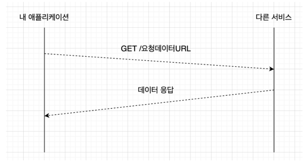

# Circuit Breaker (resilience4j)

Spring Cloud resilience4j는 SpringBoot 애플리케이션에서 resilience4j 라이브러리를 쉽게 통합할 수 있도록 도와주는 프로젝트이다.



애플리케이션에서 다른 서비스의 API를 호출해 응답 데이터를 받을 때, 두 서비스 간의 통신에 문제가 생길 수 있다.

예를 들어 서비스 가용 리소스가 적어 요청을 처리하는데 과도한 시간이 걸릴 수 있고,\
호출받는 서비스에 장애가 발생해 요청을 처리하지 못할 수도 있다.

이는 A의 애플리케이션이 B의 애플리케이션의 상태나 장애에 의존적인 상황이 펼쳐지기 때문이다.
그리고 이러한 상황을 막기 위해 Circuit Breaker 라는 패턴이 등장하게 되었다.

## 개요

Circuit Breaker 패턴은 회로 차단기에서 착안한 디자인 패턴이다.\
따라서 평소에는 회로를 닫아 (CLOSED) 정상적인 동작을 하다가 문제가 생겼을 때 회로를 열어 (OPEN) 동작을 멈추게 한다.\
즉, 문제가 생겼을 경우 해당 프로세스가 리소스를 점유하지 않도록 할 수 있는 것이다.\
이를 통해 다른 서비스에서의 장애가 우리 서비스의 장애로 이어지지 않도록 해준다.

## 상태 값


Circuit Breaker 패턴에는 3가지의 상태가 있다.
- CLOSED : 정상 상태
- OPEN : 오류 상태
- HALF_OPEN : 오류 상태에서 정상 상태 여부를 판단하기 위한 반 열림 상태

그리고 이 상태는 아래 과정으로 결정된다.
1. 다수의 API 요청
2. API 호출 실패율이 설정해놓은 값을 넘으면 OPEN 상태로 변경
3. OPEN 상태가 되면 다시 요청이 들어왔을 때 더이상 요청을 수행하지 않고 설정해놓은 응답 값을 빠르게 리턴
4. OPEN 상태에서 일정 시간이 지나면 HALF_OPEN 상태로 변경
5. HALF_OPEN 상태에서 다시 외부 API 호출
6. 정상 응답할 경우 CLOSED 상태로 변경 / 장애 발생 시 다시 OPEN 상태로 변경

## 옵션


## 사용 방법

```

dependency {
    implementation 'org.springframework.cloud:spring-cloud-starter-circuitbreaker-resilience4j'
}
```

application.yml
```
server:
  port: 8088

spring:
  application:
    name: circuit-breaker-service

resilience4j:
  circuitbreaker:
    instances:
      cat-image-circuit-breaker: # Circuit Breaker 이름 맞추기
        baseConfig: default
    configs:
      default: # 최근 10회 요청 중 50% (5회) 이상 요청 실패시 OPEN 상태로 전환된다.
        slidingWindowType: COUNT_BASED
        slidingWindowSize: 10
        failureRateThreshold: 50
        permittedNumberOfCallsInHalfOpenState: 5
        waitDurationInOpenState: 10s # 10초 후 Half-Open 상태로 전환
        registerHealthIndicator: true

# actuator
management:
  endpoints:
    web:
      exposure:
        include:
          - "*"

  health:
    circuitbreakers:
      enabled: true
```

```
@Slf4j
@RequiredArgsConstructor
@RestController
@RequestMapping("/cats")
public class CircuitBreakerController {

    private final CircuitBreakerService circuitBreakerService;

    @GetMapping("/{id}")
    public String getCatImage(@PathVariable Long id) {
        log.info(":::::::::::::::: Call :::::::::::::::");
        return circuitBreakerService.catImage(id);
    }
}

@Slf4j
@Service
public class CircuitBreakerService {

    @CircuitBreaker(name = "cat-image-circuit-breaker", fallbackMethod = "fallbackCatImage")
    public String catImage(Long id) {
        if (id < 10L) {
            return id + " cat's image.png";
        }
        throw new RuntimeException("there is no cat's image for " + id);
    }

    private String fallbackCatImage(Long id, Throwable throwable) {
        throwable.printStackTrace();
        return "fallback cat image.png";
    }
}
```

### 실습

1. ``application.yml`` 에 10번 시도 중 5번, 50%의 실패가 있을 경우 OPEN 되도록 설정
2. ``application.yml`` 에 waitDurationInOpenState를 10초로 설정하여, 문제가 생긴 후 10초 후 HALF_OPEN이 되도록 설정
3. ``curl -X GET http://localhost:8088/cats/100`` 과 같이 잘못된 요청을 9번 보낸다.
4. 그 후 ``curl -X GET http://localhost:8088/cats/9`` 와 같이 옳은 요청을 1번 보낸다.
5. 그 후 다시 옳은 요청을 보내본다.
6. 결과는??

#### 결과

- 잘못된 요청을 5번 한 이 후
``curl -X GET http://localhost:8088/actuator/circuitbreakers | jq``로 상태 확인
```
{
  "circuitBreakers": {
    "cat-image-circuit-breaker": {
      "failureRate": "-1.0%",
      "slowCallRate": "-1.0%",
      "failureRateThreshold": "50.0%",
      "slowCallRateThreshold": "100.0%",
      "bufferedCalls": 5,
      "failedCalls": 5,
      "slowCalls": 0,
      "slowFailedCalls": 0,
      "notPermittedCalls": 0,
      "state": "CLOSED"
    }
  }
}
```
아직 설정해 놓은 10번의 요청이 되지 않았기 때문에 CLOSED 상태

- 그 후 옳은 요청을 5번 한 이 후 
```
{
  "circuitBreakers": {
    "cat-image-circuit-breaker": {
      "failureRate": "50.0%",
      "slowCallRate": "0.0%",
      "failureRateThreshold": "50.0%",
      "slowCallRateThreshold": "100.0%",
      "bufferedCalls": 10,
      "failedCalls": 5,
      "slowCalls": 0,
      "slowFailedCalls": 0,
      "notPermittedCalls": 0,
      "state": "OPEN"
    }
  }
}
```
실패율이 50%가 되어 상태가 ``OPEN``으로 변경

- 그 후 10초 이내에 옳은 요청을 보낸다 해도 ``OPEN`` 상태
- 10초가 지난 후 옳은 요청
```
{
  "circuitBreakers": {
    "cat-image-circuit-breaker": {
      "failureRate": "-1.0%",
      "slowCallRate": "-1.0%",
      "failureRateThreshold": "50.0%",
      "slowCallRateThreshold": "100.0%",
      "bufferedCalls": 1,
      "failedCalls": 0,
      "slowCalls": 0,
      "slowFailedCalls": 0,
      "notPermittedCalls": 0,
      "state": "HALF_OPEN"
    }
  }
}
```
``HALF_OPEN``으로 변경됨 (준비 상태)

- 설정과 같이 5번의 옳은 요청을 할 경우
```
{
  "circuitBreakers": {
    "cat-image-circuit-breaker": {
      "failureRate": "-1.0%",
      "slowCallRate": "-1.0%",
      "failureRateThreshold": "50.0%",
      "slowCallRateThreshold": "100.0%",
      "bufferedCalls": 0,
      "failedCalls": 0,
      "slowCalls": 0,
      "slowFailedCalls": 0,
      "notPermittedCalls": 0,
      "state": "CLOSED"
    }
  }
}
```
다시 ``CLOSED`` 상태로 변경됨


