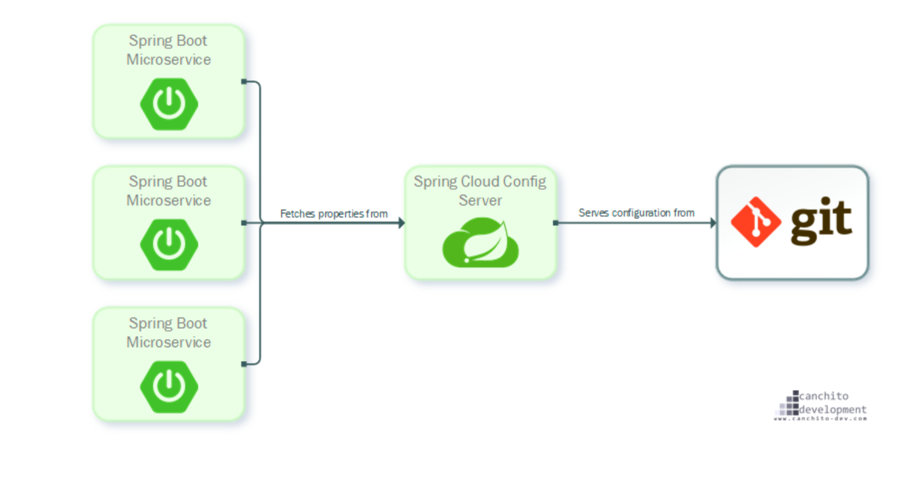
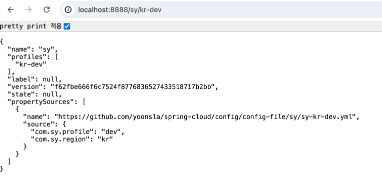
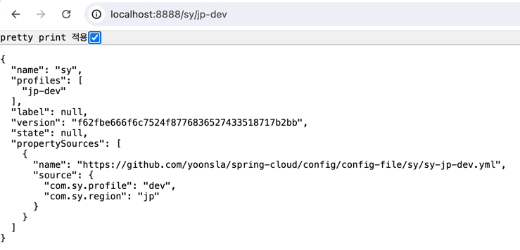

# Spring Cloud Config 란?

Spring Cloud Config는 분산 시스템에서 외부화된 설정 정보를 서버 및 클라이언트에 제공하는 시스템이다.\
Config Server는 외부에서 모든 환경에 대한 정보들을 관리하는 중앙 서버이다.\
기본적으로 설정 정보 저장을 위해 git을 사용하도록 설계되어 손쉽게 외부 도구들로 접근이 가능하며, 버전 관리도 용이하다.



Spring Cloud config는 설정 서버와 설정 클라이언트로 나뉜다.

- Sping Cloud Config Server(설정 서버): 버전 관리 레포지토리로 백업된 중앙 집중식 구성 노출을 지원한다.
- Sping Cloud Config Client(설정 클라이언트): 애플리케이션이 설정 서버에 연결하도록 지원한다.

---

## 특징

### Spring Cloud Config Server
- HTTP, 외부 구성을 위한 리소스 기반 API(이름-값 쌍 또는 동등한 YAML 콘텐츠)
- 속성 값 암호화 및 암호 해독(대칭 또는 비대칭)
- ``@EnableConfigServer``를 사용하여 쉽게 Spring Boot 애플리케이션에 포함할 수 있다.

### Config Client (Spring 애플리케이션용)
- Config Server에 바인딩하고 Environment원격 속성 소스로 Spring을 초기화한다.
- 속성 값 암호화 및 암호 해독(대칭 또는 비대칭)

---

## 장점

Spring Cloud Config는 여러 서비스들의 설정 파일을 외부로 분리해, 하나의 중앙 설정 저장소처럼 관리할 수 있도록 해주며 특정 설정 값이 변경 시 각각의 서비스를 재기동 없이 적용이 가능하도록 도와준다.
- 여러 서버의 설정 파일을 중앙 서버에서 관리할 수 있다.
- 서버를 재배포 하지 않고 설정 파일의 변경사항을 반영할 수 있다.

## 단점

- Git 서버 또는 설정 서버에 의한 장애가 전파될 수 있다.
- 우선순위에 의해 설정 정보가 덮어씌워질 수 있다.

---

## Spring Cloud Config 설정 파일 우선 순위

설정 파일은 크게 다음의 위치에 존재할 수 있으며 다음의 순서로 읽힌다.\
나중에 잃히는 파일의 우선순위가 높다.

- 프로젝트의 application.yml
- 설정 저장소의 application.yml
- 프로젝트의 application-{profile}.yml
- 설정 저장소의 {application name}/{application name}-{profile}.yml

> 동일한 값을 지니는 설정 정보가 있다면 덮어씌워지므로 주의해야한다.

ex)
``hello`` 라는 이름의 애플리케이션에 local 프로파일인 환경변수가 로컬의 application.yml, application-local.yml로 있고\
설정 저장소에 application.yml, hello/hello-local.yml이 있다면 아래의 순서로 읽힌다.

1. 프로젝트의 application.yml
2. 설정 저장소의 application.yml
3. 프로젝트의 application-local.yml
4. 설정 저장소의 hello/hello-local.yml

=> 최종적으로 hello/hello-local.yml 이 읽힌다.

---

## Spring Cloud Config Server 구축

### 설정 파일 저장소 구축

먼저 설정 파일들을 저장할 git repository 를 만든다.\
중요한 건 파일 이름인데 ``{앱 이름}-{프로파일}.yml`` 구조로 작성한다.\

- sy-jp-dev.yml
- sy-kr-dev.yml

### 설정 서버 구축

```
dependencies {
    implementation 'org.springframework.boot:spring-boot-starter-web'
    implementation 'org.springframework.cloud:spring-cloud-config-server'
}
```

설정 서버 구성을 위해서는 spring-boot-starter-web에 spring-cloud-config-server 의존성이 필요하다.


application.yml
```
server:
  port: 8888
spring:
  application:
    name: config
  cloud:
    config:
      server:
        git:
          uri: https://github.com/yoonsla/spring-cloud
          search-paths: config/config-file/**
          default-label: main
```

- ``uri`` : 설정파일이 있는 깃 주소
- ``search-paths`` : 설정 파일들을 찾을 경로
- ``default-label`` : 깃 주소의 브랜치 이름

```
@SpringBootApplication
@EnableConfigServer
public class ConfigServerApplication {

    public static void main(String[] args) {
        SpringApplication.run(TestCloudConfigServerApplication.class, args);
    }
}
```

메인 클래스에 ``@EnableConfigServer`` 을 붙여준다.

### 설정 서버 실행 및 확인

서버를 실행하면 설정 파일 저장소를 클론하고 설정 정보를 읽어오는데, spring cloud config server가 갖는 endpoint는 다음과 같다.

- /{application}/{profile}[/{label}]
- /{application}-{profile}.yml
- /{label}/{application}-{profile}.yml
- /{application}-{profile}.properties
- /{label}/{application}-{profile}.properties

=> localhost:8888/{앱이름}/{프로파일}로 접근하면 정상적으로 동작함을 확인할 수 있다.\
=> 만약 private repository 라면 SSL 설정이 추가로 필요하다.




---

## Spring Cloud Config Client 구축