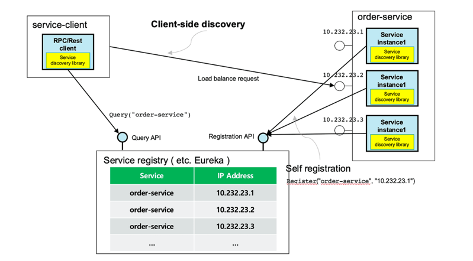
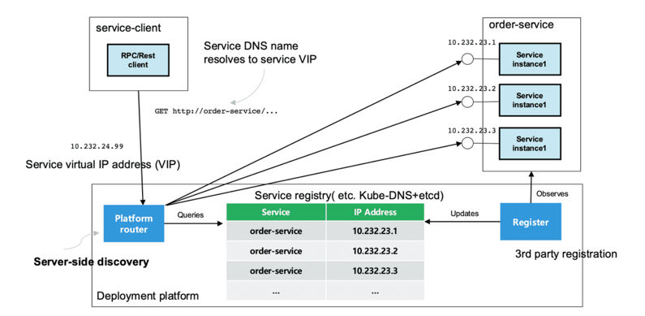
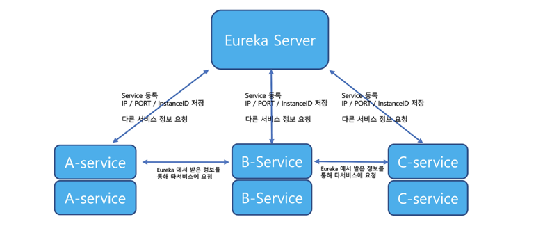
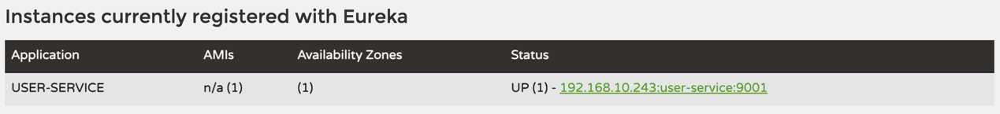
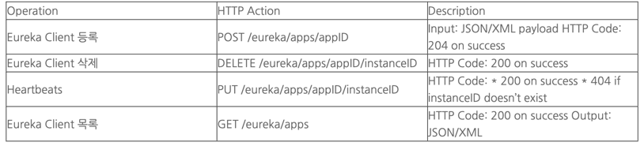

# Spring Cloud 01

---

## Service Discovery란?

Service Client가 서비스를 호출 할 때, 서비스의 위치 (IP, PORT 등)을 알아내는 방법이 필요한데,
이것을 Service Discovery 라고 한다.

스프링 클라우드는 Netflix OSS의 Eureka, Apache ZooKeeper, Consul 등 다양한 서비스 디스커버리 툴과 통합되어있다.

서비스 디스커버리는 구성하는 방법에 따라 Client side, Server side discovery로 나뉜다.\

### Client side Discovery

서비스 클라이언트가 Service Registry 를 직접 호출하여 서비스 위치를 찾은 뒤에 로드밸런싱 알고리즘을 통해 서비스를 호출한다.



대표적으로 Netflix의 Eureka / Apach의 Zookeeper 가 있다.

이 방식은 비교적 간단하며, 서비스 별로 로드밸런싱 로직을 구성할 수 있다는 장점이 있지만\
서비스와 Service Registry 간 직접적인 종속성이 생기며 서비스마다 각기 다른 언어를 사용한다면 각 언어별로 서비스 검색 로직을 구현해야 하는 단점이 있다.

### Server side Discovery

서비스 클라이언트가 Service Registry 를 호출하지 않고 Platform router 혹은 로드밸런서를 호출한다.\
이 때 요청 받든 로드밸런서는 Service Registry 를 호출하여 서비스의 위치를 알아내고 이를 기반으로 로드밸런싱된 호출을 진행한다.



이 방식은 서비스 클라이언트가 직접 서비스 검색 로직을 구현할 필요가 없기 때문에\
서비스 - Service Registry 간 종속성을 제거할 수 있다는 장점이 있다.\
반면에 로드밸런서는 고가치 장비가 추가로 필요하게 된다는 단점이 존재한다.

---

## Eureka는 무엇인가?

- Eureka는 클라우드 환경의 다수의 서비스들의 로드 밸런싱 및 장애 조치 목적을 가진 미들웨어 서버이다.
- Eureka는 미들웨어 기능을 하기 위해 각 연결된 서비스의 IP / PORT / InstanceId를 가지고 있으며 REST 기반으로 작동한다.
- Eureka는 Client-Server 방식으로 Eureka Server에 등록된 서비스는 Eureka Client로 불린다.




각 서비스를 Eureka Server에 등록하면 Eureka Server는 각 Eureka Client의 IP / PORT / InstanceId를 저장하고 
이후 Eureka Client가 다른 Eureka Client에 요청을 보낼 때 Eureka에서 받아온 정보를 가지고 요청할 수 있다.

> 서비스가 Eureka Server에 등록될 때 자신의 상태값을 전달한다.\
> 이 때 Eureka Server는 다른 Eureka Client의 정보를 제공하고 각 서비스는 Local Cache에 해당 내용을 저장한다.\
> 이후 30초마다 Eureka Server에 Heartbeats 요청을 보내고 Eureka Server는 90초 안에 Headbeats가 도착하지 않으면
> 해당 Eureka Client를 제거한다.

---

### Eureka Server (discovery module)

```
dependencies {
    implementation 'org.springframework.cloud:spring-cloud-starter-netflix-eureka-server'
}
```

의존성 추가 후 아래와 같이 @EnableEurekaServer 어노테이션을 붙여 Eureka Server임을 알려준다.

```
@SpringBootApplication
@EnableEurekaServer
public class DiscoveryApplication {
    public static void main(String[] args) {
        SpringApplication.run(DiscoveryApplication.class, args);
    }
}
```

application.yml
```
server:
  port: 8761

spring:
  application:
    name: discovery-service

eureka:
  client:
    register-with-eureka: false #eureka server를 registry에 등록할지 여부
    fetch-registry: false       #registry에 있는 정보들을 가져올지 여부
```
---
### Eureka Client (user module)

```
dependencies {
    implementation 'org.springframework.cloud:spring-cloud-starter-netflix-eureka-client'
}
```

의존성 추가 후 메인 클래스에 Eureka Client임을 알리는 @EnableDiscoveryClient 어노테이션을 사용한다.

```
@SpringBootApplication
@EnableDiscoveryClient
public class DemoApplication {
    public static void main(String[] args) {
        SpringApplication.run(DemoApplication.class, args);
    }
}
```

application.yml
```
spring:
  application:
    name: eureka-client-ex

server:
  port: 8080

eureka:
  client:
    register-with-eureka: true
    fetch-registry: true
    service-url:
      defaultZone: http://127.0.0.1:8761/eureka #Eureka Server 명시
```

#### 실행방법

user service 애플리케이션이 기동 될 때 discovery service 에 해당 서버를 등록하기 때문에 discovery service 를 먼저 실행한 후 구동해야 한다.

- DiscoveryServiceApplication.java 실행
- UserServiceApplication.java 실행

#### discovery service (server) 에 user service (client) 가 등록되었는지 확인

콘솔(server) 접속 후 Instances currently Registered with Eureka 탭에 User Service 가 존재하는지 확인

- Status 가 UP 일 경우 정상 실행 상태, DOWN 일 경우 비정상 상태
- 등록 된 서버는 Status 에 {IP주소}:{Service 이름}:{포트 번호} 형식으로 확인 가능



---
### Eureka REST




