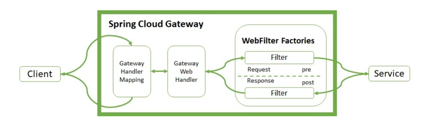

# Spring Cloud Gateway 란?

## 개요

> 스프링 클라우드 게이트웨이는 WebFlux 또는 Spring WebMVC 위에 API Gateway를 구축하기 위한 라이브러리를 제공한다.\
스프링 클라우드 게이트웨이는 API로 라우팅하고 보안, 모니터링 / 매트릭, 복원성 등을 효과적으로 제공하는 것을 목표로 한다.

Spring을 기반으로 API를 구축하는 데 사용되는 Gateway이며 클라이언트와 서비스 사이에 통신을 관리하는 역할을 한다.

``라우팅`` : 데이터가 이동할 때 경로를 정하는 프로세스
``로드밸런싱`` : 여러 서버에서 들어오는 트래픽을 균등하게 분배하여 부하를 분산하는 기술
``필터`` : 요청을 받아 보안이나 헤더 추가와 같은 특정 작업 수행


## 특징
- 모든 요청 속성에 대한 경로를 일치 시킬 수 있다.
- 술어와 필터는 경로에만 적용된다.
- 서킷브레이커와 통합
- Spring Cloud Discovery Client 와 통합
- 요청 속도에 제한이 있다.
- Spring Cloud Gateway는 netty 사용한다. (비동기 방식 지원)
---

## 장점

- Security, OAuth2 등 다양한 컴포넌트와 조합하여 효율적인 개발이 가능하다.
- WebFlux 기반의 Non-Blocking을 사용한다. 
- yaml 파일로 간단하게 라우팅이 가능하다.

## 단점

- 다른 API 게이트웨이에 비해 기능이 미숙하다.
- 모든 요청은 추가적인 오버헤드를 갖게 되어 간단한 요청에 있어서는 비효율적일 수 있다.

## 동작 과정



1. Client의 HTTP 요청이 Gateway로 들어온다.
2. Gateway Handler Mapping에서 라우팅 기능을 사용하여 이 요청을 어떤 라우트로 보낼지 결정한다.
3. 해당 라우트에 대응하는 WebHandler가 실행된다. 이는 필터 체인을 실행하여 요청 전송, 응답 생성 등의 작업을 수행하도록 한다.
4. 라우트에 정의된 작업과 필터를 완료한 후 서비스에 요청을 보낸다.
5. 서비스는 응답을 생성하고 다시 API Gateway로 보낸다.
6. 같은 방식으로 필터를 거치고 라우팅되어 Client에게 응답이 돌아간다.

---

```
dependencies {
  implementation 'org.springframework.cloud:spring-cloud-starter-gateway'
  }
```

Spring cloud Gateway는 요청을 전달하는 역할만 하기 때문에 ``@Configuration``을 사용한다.

```
@Configuration
public class FilterConfig {

    @Bean
    public RouteLocator gatewayRoutes(RouteLocatorBuilder builder) {
        return builder.routes()
                .route(predicate -> predicate.path("/first-service/**")
                        .uri("http://localhost:8081"))
                .route(predicate -> predicate.path("/second-service/**")
                        .uri("http://localhost:8082"))
                .build();
    }
}

```

- ``.route()`` : Gateway 구성의 시작, 간단히 라우트를 식별하기 위한 ID를 받는다.
- ``predicate ->`` : 해당 라우트에 적용할 조건을 정의하는 부분으로 어떤 요청에 어떻게 대응하는지를 정의한다.
- ``predicate.path()`` : 요청의 경로에 대한 조건을 설정한다. /first-service/를 통해 /first-service 이후에 어떤 경로에 대해서 일치한다는 의미이다.
- ``.filters(filter ->)`` : 요청을 가로채어 수정하거나 추가적인 동작을 수행하도록 허용한다.
- ``.filter.rewritePath()`` : 요청의 경로를 조작한다. 
- ``.uri`` : 해당 라우트로 들어온 요청이 전달될 대상 URI를 지정한다.\
즉, 어떤 서비스에 이 요청을 보낼 것인지를 결정한다.

application.yml

```
server:
  port: 8000

spring:
  application:
    name: apigateway-service
  cloud:
    gateway:
      routes:
        - id: {route의 고유 식별자}		// first-service
          uri: {해당 route의 주소} 		// http://localhost:8081/ (이동될 주소)
          predicates:			        // 해당 라우터의 조건 (사용자가 입력한 주소) (/first-service/**로 들어오는 요청은 모두 first-service route로 보낸다.
            - Path=/first-service/**
        */
        - id: {route의 고유 식별자}		// second-service
          uri: {해당 route의 주소} 		// http://localhost:8082/
          predicates:			        // 해당 라우터의 조건 (/second-service/**로 들어오는 요청은 모두 first-service route로 보낸다.
            - Path=/second-service/**
```
---

## 확인 할 것

- WebApplicationType.SERVLET → spring-boot-starter-web 의존성을 가지면 해당 타입
- WebApplicationType.REACTIVE → spring-boot-starter-webflux 의존성을 가지면 해당 타입
- WebApplicationType.NONE → 둘 다 의존성이 존재하지 않는다면 NONE 타입

=> Spring Cloud Gateway는 webflux 타입
